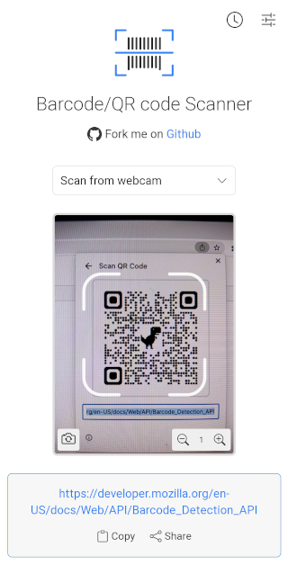
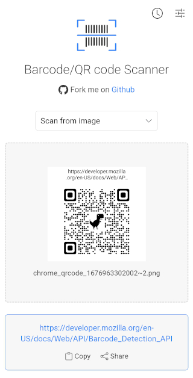

<p align="center">
  <a href="https://georapbox.github.io/barcode-scanner/">
    
  </a>
</p>

<h1 align="center">Barcode/QR code Scanner</h1>

A Progressive Web Application (PWA) that scans barcodes of various formats, using the [Barcode Detection API](https://developer.mozilla.org/docs/Web/API/Barcode_Detection_API).

> **NOTE**: The Barcode Detection API is part of the [Fugu](https://fugu-tracker.web.app/) project. Currently it is supported only on Chromium browsers in MacOS and Android. For non-supporting browsers, a [polyfill](https://github.com/gruhn/barcode-detector) is used.

[Live demo](https://georapbox.github.io/barcode-scanner/)

## Features

- Scan barcodes from web camera
- Scan barcodes from image files
- Copy detected barcode to clipboard
- Share detected barcode via Web Share API (Android)
- If barcode is a URL, offer option to open in new tab
- Offer to save detected barcodes to history (local storage)

## Screenshots




## Development

### Install dependencies

```sh
$ npm install
```

### Start development server

```sh
$ npm run start -- --open
```

### Build for production

```sh
$ npm run build
```

## License

[The MIT License (MIT)](https://georapbox.mit-license.org/@2022)
